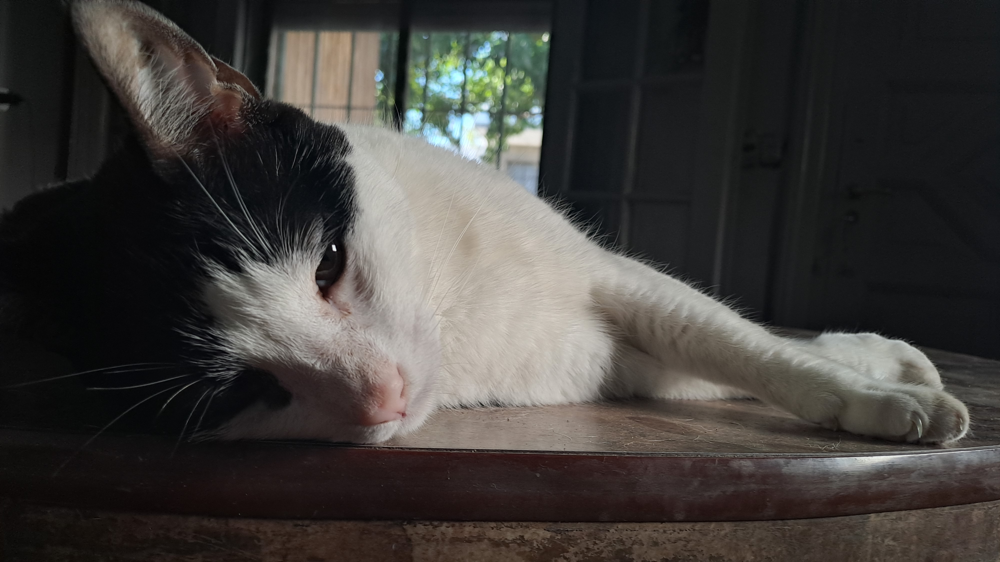

## Mateo Cimmino

Hola, mi nombre es **Mateo Cimmino**, estudio la Tecnicatura en Progamación de la *UNAHUR* hace casi dos años y me siento muy cómodo en ella.
Un amigo me recomendó seguir esta carrera, y después de investigar un poco acerca de ella decidí anotarme. Además, soy usuario de *computadoras* desde muy chico, por lo que generalmente los temas relacionados a ellas se me dan con más facilidad que otras cosas.

Trabajé en un **taller de carpintería** durante tres años, pero por conflictos laborales entre mis jefes tuve que dejar el trabajo. Hace poco conseguí un nuevo empleo como Encuestador Municipal en la Encuesta de Hogares y Empleos realizada en San Martín y otros partidos. Esto me ayuda mucho para poder cubrir mis gastos y seguir estudiando.

A medida que avanza la carrera, siento que me gusta incluso más, ya que comienza a meterse en cosas más puras de la programación y herramientas que vamos a utilizar en nuestro futuro trabajo como desarrolladores. Sin embargo, tengo que admitir que el avance de las **Inteligencias Artificiales** me hace dudar sobre la proyección al futuro de esta rama de estudio, pero confío en que el "toque humano" prevalezca sobre la excelencia de las máquinas. 

## Mis gustos
* **Música**: Paso la mayoría del día escuchando música. Mi gusto es muy variado, disfruto escuchar muchos generos distintos y hay pocos que no me gusten, aunque mi favorito es el rap, tanto en español como en inglés.
* **Gatos**: Hace cinco años adopté un gato de la calle, y desde ese día me enamoré de esta especie. Si bien hay casos en que los gatos son bastante ariscos e independientes, tuve la suerte de que me toque uno muy cariñoso (a veces excesivamente) y que no se despega de mi un segundo.

* **Ajedrez**: Recientemente adquirí un inesperado interés por el ajedrez, algo que no pensé que fuera a gustarme nunca en mi vida, pero le encuentro algo entretenido en la complejidad de sus movimientos, y me parece fascinante como cometer un simple error puede ser la diferencia entre una partida ganada y una perdida.

## Redes sociales
- [Instagram](https://www.instagram.com/_mateocimmino/)
- [LinkedIn](www.linkedin.com/in/mateo-cimmino-9aba5624a/)
